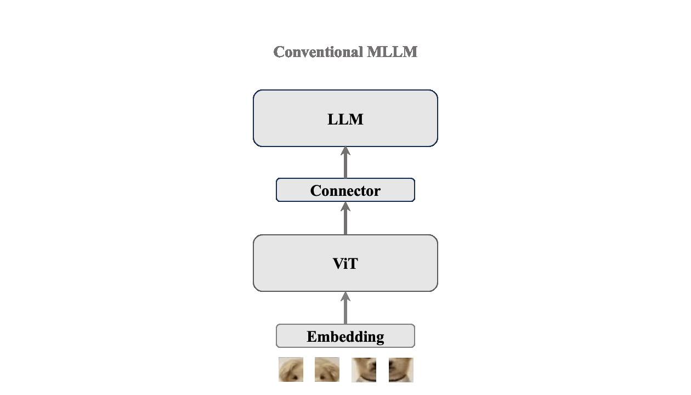

# VoRA: Integrating Visual Capabilities into LLMs

<div align="center">

[](https://georgeluimmortal.github.io/vora-homepage.github.io/)
[](https://arxiv.org/pdf/2503.20680)&nbsp;
[](https://huggingface.co/collections/Hon-Wong/vora-67ee34c9d32e9ac2358106ae)

<p style="font-size: larger; margin-top: -5px;">
  <a href="https://arxiv.org/pdf/2503.20680">Vision as LoRA</a>
</p>

<div align="center" style="width: 100%; margin: 0 auto;">
  
</div>

</div>

## News

* **2025-04-16:** Training code released.
* **2025-04-06:** [LMMs-Eval](https://github.com/EvolvingLMMs-Lab/lmms-eval/pull/616) has supported VoRA. 
* **2025-04-04:** [VoRA Weights and training data](https://huggingface.co/collections/Hon-Wong/vora-67ee34c9d32e9ac2358106ae) are released. 

<h3 align="center">Abstract</h3>

<p>We introduce Vision as LoRA (VoRA), a novel paradigm for transforming an LLM into an MLLM. Unlike prevalent MLLM architectures that rely on external vision modules for vision encoding, VoRA internalizes visual capabilities by integrating vision-specific LoRA layers directly into the LLM. This design allows the added parameters to be seamlessly merged into the LLM during inference, eliminating structural complexity and minimizing computational overhead. Moreover, inheriting the LLM's ability of handling flexible context, VoRA can process inputs at arbitrary resolutions.</p>

<p>To further strengthen VoRA’s visual capabilities, we introduce a block-wise distillation method that transfers visual priors from a pre-trained ViT into the LoRA layers, effectively accelerating training by injecting visual knowledge. Additionally, we apply bi-directional attention masks to better capture the context information of an image. We successfully demonstrate that with additional pre-training data, VoRA can perform comparably with conventional encode-based MLLMs.</p>

## Install

Clone this repository and install dependencies:
```bash
git clone https://github.com/Hon-Wong/VoRA.git
cd VoRA
pip3 install -e .
```

## Data Preparation

We have collected or generated the following datasets for VoRA. The image bytes are also included, so there’s no need to download the images from URLs. The captions were created using a variety of prompts to ensure diversity.

| HF dataset 🤗 | #Samples | Source | Generated by |
| ------------ | -------------- | ------------ | ------------ |
| [VoRA-Recap-8M](https://huggingface.co/datasets/Hon-Wong/VoRA-Recap-8M) | 8M | DataComp-1B | [Qwen2-VL-72B-Instruct](https://huggingface.co/Qwen/Qwen2-VL-72B-Instruct) |
| [VoRA-Recap-29M](https://huggingface.co/datasets/Hon-Wong/VoRA-Recap-29M) | 29M | DataComp-1B | [Qwen2-VL-72B-Instruct](https://huggingface.co/Qwen/Qwen2-VL-72B-Instruct) |
| [VoRA-Recap-GLDv2-1.4M](https://huggingface.co/datasets/Hon-Wong/VoRA-Recap-29M) | 1.4M | GLDv2 | [Qwen2-VL-72B-Instruct](https://huggingface.co/datasets/Hon-Wong/VoRA-Recap-GLDv2-1.4M) |
| [VoRA-TextQA-Mixed](https://huggingface.co/datasets/Hon-Wong/VoRA-TextQA-Mixed) | 6.3M | Cambrian, LLaVA-ov, Infinity-Instruction, SmolTalk | - |

1. download the pre-training datasets from HF.

datasets for ablation study
```bash
apt-get install git-lfs
git-lfs install
cd {raw_data_dir}
git clone https://huggingface.co/datasets/Hon-Wong/VoRA-Recap-8M
```
datasets for Pre-training
```bash
apt-get install git-lfs
git-lfs install
cd {raw_data_dir}
git clone https://huggingface.co/datasets/Hon-Wong/VoRA-Recap-29M
git clone https://huggingface.co/datasets/Hon-Wong/VoRA-Recap-GLDv2-1.4M
git clone https://huggingface.co/datasets/Hon-Wong/VoRA-TextQA-Mixed
```
  
2. convert parquet to json
   
For ablation:
```bash
python3 tools/parquet2json.py --dataset_dir={raw_data_dir}/VoRA-Recap-8M --save_dir={data_dir}/VoRA-Recap-8M
```
For Pre-training:
```bash
python3 tools/parquet2json.py --dataset_dir={raw_data_dir}/VoRA-Recap-29M --save_dir={data_dir}/VoRA-Recap-29M
python3 tools/parquet2json.py --dataset_dir={raw_data_dir}/VoRA-Recap-GLDv2-1.4M --save_dir={data_dir}/VoRA-Recap-GLDv2-1.4M
python3 tools/parquet2json.py --dataset_dir={raw_data_dir}/VoRA-TextQA-Mixed --save_dir={data_dir}/VoRA-TextQA-Mixed
```

3. Prepare [LLaVA-mixture](https://huggingface.co/datasets/liuhaotian/LLaVA-Instruct-150K)

convert it to VoRA's format:
```json
{
  "id": "00000000",
  "frames": [
      "frames/00000000.jpg",
  ],
  "conversations": [
      {
          "from": "human",
          "value": "Describe this image in detail."
      },
      {
          "from": "gpt",
          "value": "<image>\nThis image is a ..."
      }
  ]
}
```

Also, if you want to use your own data, simply follow the step to format.

## Training

1. Pre-training

Set the config file in `configs/pretrain_I30M_T6M.yaml`. Make sure the global batchsize is 256. Change the data path and model path to your local ones.
   
Train VoRA on a single node with 8 GPUs:
```bash
deepspeed --master_port=20000 train/train.py configs/pretrain_I30M_T6M.yaml
```

Train VoRA on multi nodes:
```bash
torchrun --nproc_per_node 8 --nnodes 4 --node_rank $NODE_RANK --master_addr $MASTER_ADDR --master_port $MASTER_PORT train/train.py configs/pretrain_I30M_T6M.yaml
```

2. Finetuning

Merge LoRA weights into the base model:

```bash
python3 tools/merge_lora.py --config=configs/pretrain_I30M_T6M.yaml --checkpoint={your_checkpoint_dir} --save_dir={your_save_dir}
```

Then set the model.pretrained in configs/finetune.yaml, and run:

```bash
deepspeed --master_port=20000 train/train.py configs/finetune.yaml
```

## Evaluation

The original results in the paper were evaluated using a suite similar to LLaVA. Alternatively, you can use [LMMs-Eval](https://github.com/EvolvingLMMs-Lab/lmms-eval) to evaluate the model.

1. Install LMMs-Eval:
```bash
git clone https://github.com/EvolvingLMMs-Lab/lmms-eval
cd lmms-eval
pip3 install -e .
```

2. Evaluate
   
Evaluate the checkpoints in the paper:

```bash
export HF_TOKEN={your_hf_token}
python3 -m accelerate.commands.launch --num_processes=8 --main_process_port=51999 -m lmms_eval --tasks textvqa_val --model vora --model_args pretrained=Hon-Wong/VoRA-7B-Instruct --batch_size 1 --log_samples --output_path ./logs/
```

Evaluate your own model:

```bash
export HF_TOKEN={your_hf_token}
cp generation_files/* {your_model_dir}
python3 -m accelerate.commands.launch --num_processes=8 --main_process_port=51999 -m lmms_eval --tasks textvqa_val --model vora --model_args pretrained={your_model_dir} --batch_size 1 --log_samples --output_path ./logs/
```

# Citation

If you find this repository useful, please consider citing and starring it:

```
@article{wang2025vision,
  title={Vision as LoRA},
  author={Wang, Han and Ye, Yongjie and Li, Bingru and Nie, Yuxiang and Lu, Jinghui and Tang, Jingqun and Wang, Yanjie and Huang, Can},
  journal={arXiv preprint arXiv:2503.20680},
  year={2025}
}
```
